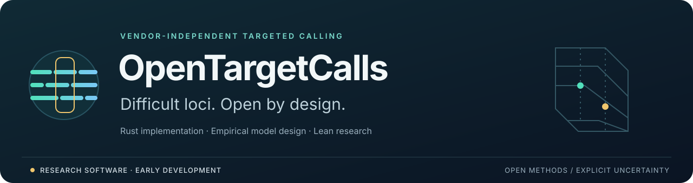

# OpenTargetCalls



[](https://github.com/sounkou-bioinfo/OpenTargetCalls/actions/workflows/build.yml)
[](LICENSE)
[](docs/roadmap.md)

**Open, vendor-independent targeted calling for medically relevant difficult loci.**

Instrument vendor is not an eligibility restriction. The goal is independent
short-read WGS and supported WES analysis across sequencing platforms, with
explicit uncertainty and no-calls when evidence cannot support a result.

> **Research software.** The registry, Unum HLA/KIR adapter and prepared-evidence
> HBA scoring kernel are runnable. Native alignment I/O, empirical calibration
> and analytical validation remain planned. File compatibility does not establish
> accuracy for an instrument, chemistry, assay or target.

[Architecture](docs/architecture.md) · [I/O design](docs/io.md) ·
[Error models](docs/error-model.md) · [Roadmap](docs/roadmap.md) ·
[Lean and assurance](docs/certificates.md)

## Start here

Rust 1.85 or newer is required. The current package has no runtime crate
dependencies; native HTS dependencies belong to the planned I/O implementation.

```bash
git clone https://github.com/sounkou-bioinfo/OpenTargetCalls.git
cd OpenTargetCalls
cargo build --locked --release
./target/release/opentargetcalls targets
```

The Rust package, library and executable are all named `opentargetcalls`.
`make install` installs the executable under `~/.local/bin` by default.

## What runs today

| Target | WGS contract | WES contract | Implementation |
|---|---|---|---|
| HLA, KIR | observable | capture-dependent | external Unum adapter |
| HBA | observable | validated enrichment | prepared-evidence scoring kernel |
| SMN | observable | validated enrichment | registry only |
| CYP2B6, CYP2D6, CYP21A2, GBA | observable | not observable | registry only |
| LPA, RH | observable | not observable | registry only |

The finite registry covers the DRAGEN v4.5 targeted-caller set plus HLA and KIR.
These are assay contracts, not completed-caller or clinical-performance claims.
Read-level support, resource completeness and target-specific validation remain
separate requirements. See [the target scope](docs/scope.md).

```bash
cargo run -- targets --assay wes
cargo run -- targets --assay wes --validated-enrichment
```

### HBA: inspect the scoring kernel

The kernel selects from a supplied hypothesis catalogue using integer penalties:

```text
prior_penalty + sum(ceil(abs(observed - expected) / tolerance) * weight)
```

A unique minimum must satisfy the requested runner-up margin; otherwise the
result is a no-call. This is a deterministic heuristic, not a calibrated
likelihood or an end-to-end HBA caller.

```bash
work=$(mktemp -d)
cargo run -- hba \
  --assay wgs \
  --evidence examples/hba/evidence.synthetic.tsv \
  --hypotheses examples/hba/hypotheses.synthetic.tsv \
  --min-margin 10 \
  --certificate "$work/hba.cert"

cargo run -- verify --certificate "$work/hba.cert"
rm -r "$work"
```

The example resources are synthetic. `verify` checks metadata consistency;
it does not reopen hashed artifacts or rerun inference.

### HLA/KIR: use an external backend

[Unum](https://github.com/fg-labs/unum) owns read extraction and allele inference.
OpenTargetCalls owns assay declarations, result normalization and provenance.
Install Unum and its appropriate reference resources separately.

```bash
cargo run -- unum \
  --target HLA \
  --assay wgs \
  --unum /path/to/unum \
  --bam sample.bam \
  --ref-seq hla.ref.fa \
  --ref-coord hla.coord.fa \
  --bam-mode alignment \
  --output-prefix results/sample.hla \
  --threads 8 \
  --certificate results/sample.hla.cert
```

KIR uses the same command with KIR reference resources. Backend execution is not
an independent truth-set validation.

## Where the implementation is heading

```text
qualified BAM/CRAM + reference + declared run/assay metadata
                            ↓
             explicit observations and error counts
                            ↓
          frozen empirical models with support checks
                            ↓
        target-specific evidence, likelihoods and no-calls
```

The [workspace design](docs/architecture.md) separates `otc-core`, `otc-io` and
the CLI. It starts with a qualified HTSlib backend and keeps sequencing errors,
indels/repeat lengths, mapping uncertainty and copy-number depth distinct.
The workspace split and native readers are not yet implemented.

The [mapchk source study](docs/research/mapchk.md) traces Heng Li's SBX empirical
error statistic to pinned C source and executable synthetic fixtures. It is a
method characterization, not reproduction of the Roche accuracy curves.

## Tests and research models

```bash
make test       # Rust unit and CLI tests
make lint       # Clippy
make smoke      # registry and synthetic HBA CLI workflow
make proof      # Lean models; toolchain pinned in lean-toolchain
```

Lean lives under `OpenTargetCalls/` for paper formalizations and model
justification. Its current proofs concern a separate mathematical model, not
Rust equivalence or biological validity. Hashes, metadata consistency,
mathematical proofs and empirical validation are distinct forms of evidence.
See [the assurance boundary](docs/certificates.md).

## License and citation

MIT; see [LICENSE](LICENSE). Cite this repository and the target-specific methods
used by a run; metadata is in [CITATION.cff](CITATION.cff).

For the independent toolbox distribution, build the frozen
[v0.1.0 source release](https://github.com/sounkou-bioinfo/OpenTargetCalls/releases/tag/v0.1.0).
OpenTargetCalls defines its own API without toolbox compatibility aliases.
